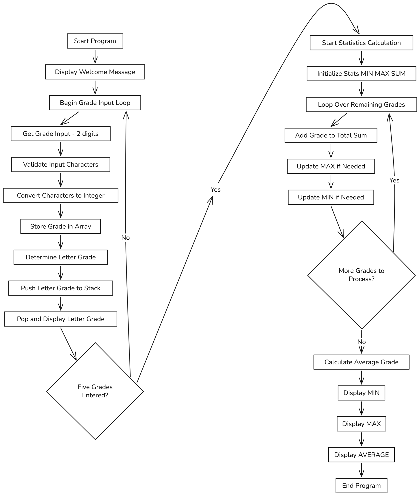

# ***CIS-11 Project Documentation***

# 

**Team of Spring**  
**Ryan Mendez, Kevin Morris, Eiko Fukushima, Aprajita**  
**Test Score Calculator**  
**5/25/2025**

**Advisor: Kasey Nguyen, PhD**

# **Part I – Application Overview**

## **Objectives**

#### **Why are we doing this?**	

* The primary objective of the Test Score Calculator project is to enhance the efficiency and accuracy of evaluating academic test scores in an educational setting, particularly in computer science courses where LC-3 assembly language (little computer 3\) is taught. This project supports educational outcomes by reinforcing concepts such as loops, conditionals, memory handling, and user interaction within the constraints of the low-level programming, LC-3.

* This project is being pursued now as part of a learning module designed to deepen students’ understanding of assembly language. Implementing it at this stage allows students to apply recently acquired knowledge in a practical context. Delaying or skipping the project would mean losing a valuable opportunity to reinforce these foundational skills through hands-on experience. It could also limit students' exposure to real-world problem solving using limited system resources.

* The primary beneficiaries are students and educators. Students benefit by practicing real programming logic in LC-3, which strengthens their grasp of computer architecture and low-level programming. Instructors benefit by gaining a simple, demonstrable tool to evaluate student understanding. While the tool itself is modest in scope, it represents one of the most direct and practical ways for students to internalize the course material. Given its relevance and educational value, this project is a fitting priority at this point in the curriculum and does not compete with higher-impact projects in this context.

## **Business Process**

### *Currently, students or users manually calculate their test statistics—minimum, maximum, average scores—and determine the corresponding letter grade using a calculator. This process can be time-consuming and prone to errors. The introduction of the Test Score Calculator does not change the overall business process of score evaluation, as users still input their test results to understand their academic performance. However, the application streamlines this process by automating calculations and instantly providing accurate results. This saves users time and reduces the risk of mistakes, offering a faster and more reliable way to assess test scores.*

## **User Roles and Responsibilities**

## **Production Rollout Considerations**

### *The rollout of the Test Score Calculator will be straightforward due to the application’s small scale and single-user focus. The program will be deployed as a compiled LC-3 assembly file (.obj) that can be loaded directly into any standard LC-3 simulator, such as PennSim or LC3Edit. Distribution may occur through a shared folder, email, or an institutional learning management system.*

### *Since the application does not rely on persistent data storage or external databases, no data population is required prior to rollout. Each user session is independent, with data (test scores) entered in real time by the user and discarded at the end of the session. As such, there is no need for a system-wide initialization or migration of existing records.*

### *The expected data volume is minimal, limited to five integers per user session. Transaction volume is also low, as the application is intended for individual, interactive use—typically by students testing a small number of scores at a time. This makes the system suitable for immediate rollout without requiring phased deployment, load balancing, or server-side resources.*

### *Any updates to the application (e.g., adding new features or fixing bugs) can be distributed by replacing the .obj file and informing users of the new version*

## **Terminology**

### ***Test Score:** A numerical value representing a user's performance on a test, assumed to be an integer between 0 and 100 in this application.*

### ***Valid Score:** Any integer input that falls within the inclusive range of 0 to 100\. Scores outside this range are considered invalid and are rejected by the program.*

### ***Average Score:** The sum of the five valid test scores divided by five, using integer division (no decimal places are included).*

### ***Maximum Score:** The highest value among the five valid test scores entered by the user.*

### ***Minimum Score:** The lowest value among the five valid test scores entered by the user.*

### ***Letter Grade:** A character (A, B, C, D, or F) that corresponds to the average score, based on a standard grading scale.*

### ***Prompt:** A message displayed to the user asking them to enter input, such as a test score.*

### ***Re-prompt:** A repeated request for input, shown when the user enters an invalid score.*

### ***LC-3 Console:** The text-based output window used in LC-3 simulators (such as PennSim or LC3Edit) to interact with the program.*

### ***User:** A person running the Test Score Calculator, typically a student or someone entering test data for evaluation.*

# **Part II – Functional Requirements**

# 

# 

# 

# **Statement of Functionality**

### *The Test Score Calculator is an LC-3 assembly language application that allows a user to input five test scores and receive a summary including the minimum, maximum, average score, and corresponding letter grade. Upon starting the program, the user is prompted five times to enter a test score. Each score must be an integer between 0 and 100\. If an invalid score is entered, the user is prompted to re-enter it until a valid input is received.*

### *Once all five valid scores are entered, the program calculates the highest and lowest scores, then computes the average by summing the scores and dividing by five using integer division. Based on the average, a letter grade is assigned as follows: 90–100 is an 'A', 80–89 is a 'B', 70–79 is a 'C', 60–69 is a 'D', and below 60 is an 'F'. The program then displays the maximum score, minimum score, average score, and letter grade, all clearly labeled in a text format on the LC-3 console. The application is designed for casual users and requires no advanced knowledge or user login.*

### *This document defines the complete and exclusive set of functions that the Test Score Calculator will support. Any features or behaviors not explicitly described here are considered out of scope for this version of the application.*

## **Scope**

### *The Test Score Calculator will be built and completed in a single phase. All of the features described in the Statement of Functionality will be included in this first version. This means the program will let the user enter five test scores, check that the scores are valid, calculate the highest, lowest, and average scores, figure out the correct letter grade, and show all of that information clearly on the LC-3 screen.*

### *There are no extra features planned for later phases. Everything that the program is supposed to do will be finished and working in this first release. If new features are needed in the future—like handling more than five scores, saving results to a file, or adding a visual interface—they would be added in a separate project phase, not part of this one.*

## **Performance**

### *The Test Score Calculator is designed to operate efficiently within the constraints of the LC-3 environment. When the program prompts the user for each test score, it is expected to display the prompt and begin accepting input within two seconds, assuming the user is typing at a normal speed and provides valid input. If an invalid score is entered, the program should recognize the error and re-prompt the user in less than one second. After the fifth valid score is entered, the calculator will perform all required computations—including determining the minimum, maximum, and average scores, as well as assigning a letter grade—in under one second. The final output, displaying all results, should appear on the console within one second after the last score has been entered. These performance expectations are based on the program running in a standard LC-3 simulator and assume typical user interaction without delays.*

## **Usability**

### *The Test Score Calculator is intended to be easy to use for individuals with little to no experience in assembly language or technical systems. To meet this goal, all prompts and outputs will be presented in clear, simple English, with no abbreviations or technical jargon. The program should require no more than one keystroke (the Enter key) to confirm each score input, and users should be able to complete the full interaction—from entering the first score to viewing the results—in under two minutes under normal conditions. All error messages will clearly explain the issue (e.g., “Invalid score. Please enter a number between 0 and 100.”) and re-prompt the user without restarting the program or requiring complex navigation. The user interface, though text-based, must remain uncluttered and follow a consistent structure for prompts and results, minimizing cognitive load and confusion. Overall, the program should be fully usable by a first-time user without requiring additional instructions or documentation.*

# **Documenting Requests for Enhancements**

| Date | Enhancement | Requested by | Notes | Priority | Release No/ Status |
| :---- | :---- | :---- | :---- | :---- | :---- |
| 5/23/2025 | Allow more than five test scores | Instructor | Useful for broader test sets; requires loop changes | Medium | Planned |
| 5/23/2025 | Add support for decimal average (with rounding) | Student | Improves grade precision; may need division routine | Low | Under Review |
| 5/23/2025 | Include input confirmation before calculation | TA | Prevents errors from typos | Hgh | Plannet |

### 

# **Part III – Appendices**

* ### Example Use Case \- A student uses the Test Score Calculator to find their average score and letter grade. The program prompts for five test scores, for example, 78, 85, 90, 87, and 92\. After input, it calculates and displays the highest score (92), lowest score (78), average score (86), and letter grade (‘B’). This shows how the program helps users quickly understand their test results.

* Potential Extensions \- Future updates could allow users to enter more than 5 test scores. The program might also support calculating averages with decimal precision and rounding. Additional features could include saving and loading scores from files and adding GUI (graphical user interface). These ideas are provided for future development and are outside the scope of the current project.

### 

## 

## **Flow chart or pseudo-code.**

